# 📊 Finkargo Data Strategy Analysis

## 🔄 Current Data Flow (What We Have)

## 🚀 Proposed Enhanced Data Strategy (What We Should Build)

```mermaid
graph TB
    subgraph "Multi-Source Data Input"
        INV[📊 Inventory CSV]
        SALES[💰 Sales CSV/API]
        CUST[👥 Customer Data]
        SUPP[🏭 Supplier Data]
        SHIP[🚚 Shipment Data]
        FIN[💳 Financial Data]
    end
    
    subgraph "Data Enrichment Layer"
        INV --> MASTER[Master Data Hub]
        SALES --> MASTER
        CUST --> ENRICH[Data Enrichment<br/>- Auto-populate suppliers<br/>- Extract customer profiles<br/>- Identify relationships]
        SUPP --> ENRICH
        SHIP --> ENRICH
        FIN --> ENRICH
        ENRICH --> MASTER
    end
    
    subgraph "Intelligence Processing"
        MASTER --> INTEL1[Customer Intelligence<br/>- Buying patterns<br/>- Seasonality<br/>- Preferences<br/>- Credit worthiness]
        MASTER --> INTEL2[Supplier Intelligence<br/>- Performance scores<br/>- Lead times<br/>- Reliability<br/>- Pricing trends]
        MASTER --> INTEL3[Market Intelligence<br/>- Demand forecasting<br/>- Price optimization<br/>- Competitor analysis<br/>- Market trends]
        MASTER --> INTEL4[Risk Intelligence<br/>- Supply chain risks<br/>- Payment risks<br/>- Currency exposure<br/>- Geopolitical factors]
    end
    
    subgraph "Analytics Aggregation"
        INTEL1 --> AGG[Cross-Data Analytics<br/>- Multi-period trends<br/>- Comparative analysis<br/>- Predictive models<br/>- Anomaly detection]
        INTEL2 --> AGG
        INTEL3 --> AGG
        INTEL4 --> AGG
    end
    
    subgraph "AI Enhancement"
        AGG --> AIENG[Enhanced AI Engine<br/>- Multiple specialized agents<br/>- Cross-data insights<br/>- Predictive recommendations<br/>- Risk mitigation strategies]
    end
    
    subgraph "Data Marketplace"
        AIENG --> MARKET[Anonymized Market Data<br/>- Industry benchmarks<br/>- Supplier ratings<br/>- Pricing intelligence<br/>- Best practices]
    end
    
    style MASTER fill:#ccffcc
    style MARKET fill:#ccccff
```

## 📈 Current vs Potential KPIs & Visualizations

### 🔴 Current State (Limited by Single CSV)

| Category | Current KPIs | Visualization |
|----------|--------------|---------------|
| **Inventory** | • Days of Stock • Turnover Rate • Stock Levels | Basic alerts list |
| **Financial** | • Inventory Value • Cash Tied Up • Monthly Burn | Text summaries |
| **Performance** | • Sales Velocity • ROI % | Product list |
| **Alerts** | • Stockout Risk • Overstock Items | Alert cards |

### 🟢 Proposed State (Multi-Source Intelligence)

| Category | Enhanced KPIs | Advanced Visualizations |
|----------|---------------|------------------------|
| **Customer Intelligence** | • Customer Lifetime Value • Churn Risk Score • Purchase Frequency • Average Order Value • Payment Behavior Score • Growth Potential | • Customer segmentation matrix • CLV progression charts • Churn prediction heatmap • Customer journey flows |
| **Supplier Intelligence** | • On-time Delivery Rate • Quality Score • Price Competitiveness • Lead Time Reliability • Financial Stability • Capacity Utilization | • Supplier scorecards • Performance radar charts • Lead time distributions • Supplier comparison matrix |
| **Market Intelligence** | • Market Share Trends • Demand Elasticity • Seasonal Patterns • Competitive Positioning • Price Optimization Points | • Market share evolution • Demand forecasting curves • Competitive landscape map • Price sensitivity analysis |
| **Financial Analytics** | • Cash Conversion Cycle • Working Capital Optimization • Credit Risk Exposure • Currency Impact • Financing Opportunities | • Cash flow waterfalls • Working capital dashboard • Risk exposure treemap • Scenario simulations |
| **Supply Chain Health** | • End-to-end Lead Time • Supply Chain Resilience Score • Bottleneck Identification • Alternative Supplier Options • Risk Mitigation Effectiveness | • Supply chain network map • Risk heat matrix • Bottleneck flow diagram • Resilience scoring |

## 🎯 Data Collection Strategy

### Phase 1: Immediate Quick Wins

### Phase 2: Multi-File Support

### Phase 3: API Integrations

## 💡 Key Insights

### 🔴 Current Limitations:
1. **Single Data Source**: Only processes combined inventory/sales CSV
2. **No Data Persistence**: Each upload is isolated
3. **Mock Visualizations**: BI components use synthetic data
4. **Limited Intelligence**: Basic metrics only
5. **No Supplier/Customer DB**: Missing relationship data

### 🟢 Competitive Advantages We Can Build:
1. **Auto-Population**: Extract and build supplier/customer databases from uploads
2. **Cross-Upload Intelligence**: Aggregate insights across multiple uploads
3. **Relationship Mapping**: Understand supplier-product-customer relationships
4. **Predictive Analytics**: Use historical data for forecasting
5. **Market Intelligence**: Anonymous aggregated insights from all users

## 🚀 Implementation Priority

### Week 1: Extract More from Current Data
- Parse supplier names from CSV
- Identify customer patterns from sales data
- Build initial relationship database
- Enable multi-upload aggregation

### Week 2: Expand Input Capabilities
- Separate sales CSV upload
- Customer master data upload
- Supplier information upload
- Link data across uploads

### Week 3: Intelligence Layer
- Customer segmentation engine
- Supplier scoring system
- Market trend analysis
- Risk assessment models

### Week 4: Data Marketplace
- Anonymize and aggregate data
- Create industry benchmarks
- Build subscription tiers
- Launch intelligence marketplace

## 📊 The Data Moat Strategy

**The more data users upload → The smarter the system → The more value for all users → The stronger our competitive moat**